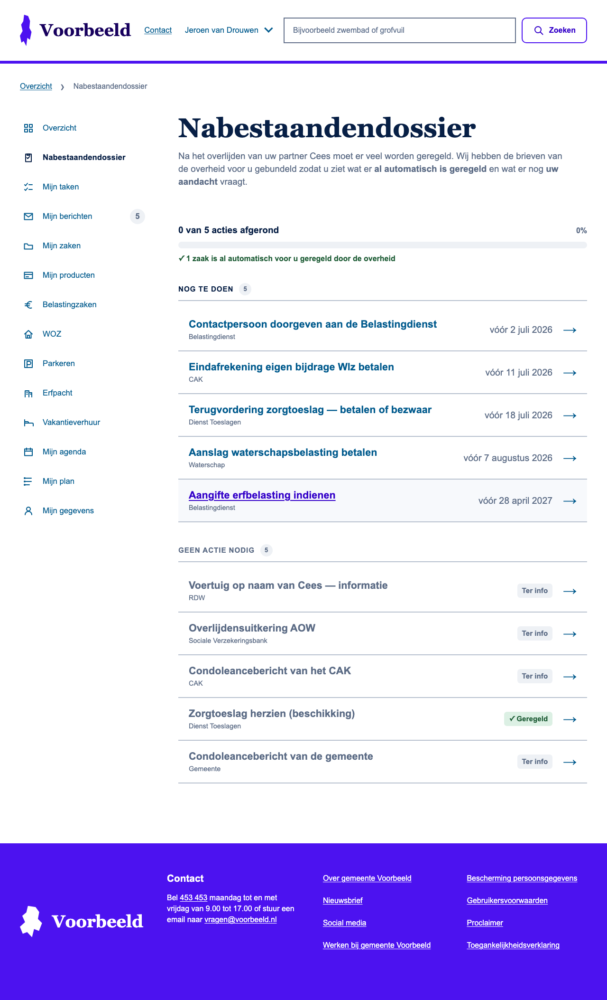
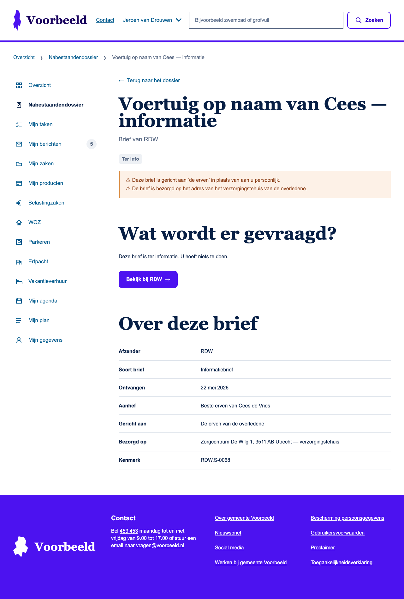
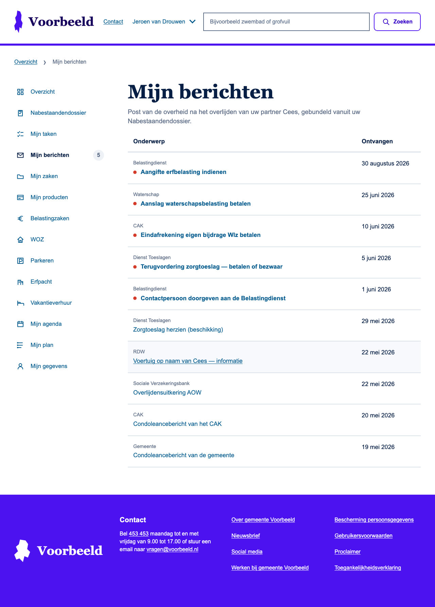

# Nabestaandendossier — OneGov #2 demo

> _Van chaos naar regie: één overheidsoverzicht voor nabestaanden._

Voor de [OneGov AI hackathon](https://alkem.io/onegov-hackathon) zijn Vincent van Beek en ik aan de
slag om een prototype te bouwen voor een [specifieke challenge](https://github.com/govtechnl/onegov2-inwoner-centraal):

> **How can we help bereaved partners get a complete, proactive, personalised view of their rights
> and obligations across the entire government — without making them chase it themselves?**

Als iemand een partner verliest, breekt naast het verdriet ook een **administratieve storm** los:
tientallen brieven van gemeente, Belastingdienst, SVB, CAK, RDW, waterschap… zonder onderlinge
afstemming, vaak gericht aan _"de erven"_ en bezorgd op het verkeerde adres. Deze demo laat zien hoe
de overheid die losse poststroom kan bundelen tot **één overzicht** waarin de nabestaande ziet wat er
**al automatisch is geregeld** en wat er nog **aandacht vraagt**.

**🔗 Live demo:** **https://t-1sk9qbdw.tunn.dev/#plannen**
_(draait via een tunnel naar mijn laptop — kan tijdelijk offline zijn)_



## In deze demo

- **Nabestaandendossier** — een nieuwe pagina met een overzicht van **taken en brieven**, gesplitst in
  _Nog te doen_ en _Geen actie nodig_, gesorteerd op urgentie, met een voortgangsindicator en de
  geruststelling "X zaken zijn al automatisch geregeld".
- **Briefdetail** — elke brief is klikbaar: afzender, aanhef, aan wie gericht, op welk adres, wat er
  gevraagd wordt + een knop naar de afhandeling. Het signaleert de adresserings-pijnpunten uit de
  challenge (gericht aan _"de erven"_, bezorgd op het verzorgingstehuis-adres).
- **Mijn berichten** — diezelfde correspondentiestroom als berichtenoverzicht; brieven die actie
  vragen staan als _ongelezen_.
- **Een simpele back-end** gebaseerd op het **MijnTaken-contract** (`POST /context/zoek`,
  `GET /taken/{uuid}`) — zodat anderen tijdens de hackathon **echt taken voor een burger kunnen
  aanmaken en bewerken** via de API.
- **Integratie** met de bestaande **Overzicht-pagina** (prominente banner + de open taken) en de
  **sidebar** (tweede menu-item, met badge).

| Briefdetail (met pijnpunt-signalering) | Mijn berichten |
|---|---|
|  |  |

## Hoe het werkt

- **Correspondentie → taak.** Elke brief uit de poststroom wordt een taak (afzender, brief-type,
  ontvangstdatum, actie-nodig, deadline) die kan leiden tot een _zaak-aanvraag_. Het portaal **toont**
  en **verwijst**; de afhandeling zelf gebeurt bij de provider (buiten scope).
- **MijnTaken-contract.** De datavorm volgt de [VNG MijnTaken API](https://github.com/vng-realisatie/mijn-taken-api),
  zodat de demo 1-op-1 op een echte provider aangesloten kan worden.
- **Officiële synthetische data.** De brieven komen uit de golden fixture (Truus/Cees) van de
  [challenge-dataset](https://github.com/govtechnl/onegov2-inwoner-centraal); `data/build-seed.mjs`
  converteert die naar de demo-seed.
- **Geen build.** Vanilla HTML/CSS/JS. De back-end is een zero-dependency Node-server die de app
  **én** de API op één URL serveert.
- **Live updates.** Wijzig je een taak via de API, dan ververst elke open tab vanzelf (Server-Sent
  Events). State wordt bewaard in een JSON-bestand, dus een herstart overleeft hij.

## Lokaal draaien

Node 18+ vereist, verder niets.

```sh
node backend/server.mjs
# open http://localhost:8787/#plannen
```

De server serveert de app same-origin én de API, dus alles werkt op één URL — geen CORS, geen config.

**Online zetten** met één tunnel (geen account nodig):

```sh
npx cloudflared tunnel --url http://localhost:8787
# deel https://<tunnel>/#plannen
```

## Naar de demo schrijven (API)

Hackathon-deelnemers kunnen taken/brieven voor de burger **aanmaken en bewerken**. Alleen `titel.nl`
is verplicht.

```sh
# Nieuwe brief/taak aanmaken
curl -X POST https://<tunnel>/taken \
  -H 'content-type: application/json' \
  -d '{
    "organisatie": "svb",
    "titel": { "nl": "Mogelijk recht op nabestaandenuitkering (Anw)" },
    "briefType": "actiebrief",
    "actieNodig": true,
    "deadline": "2026-07-15T23:59:59+02:00",
    "leidtTotZaak": "Aanvraag Anw-uitkering",
    "aanhef": "Geachte mevrouw de Vries-Bakker",
    "geadresseerde": "partner",
    "uitvoering": { "canonicalUrl": "https://www.svb.nl/nl/anw" }
  }'

# Taak afronden
curl -X PATCH https://<tunnel>/taken/<uuid> -H 'content-type: application/json' -d '{"status":"afgerond"}'
```

De brief verschijnt **direct** in elke open app (via de live-update). Belangrijkste velden:

| Veld | Type | Toelichting |
|---|---|---|
| `titel.nl` | string | **Verplicht.** Onderwerp van de brief. |
| `organisatie` | string | `gemeente`, `belastingdienst`, `toeslagen`, `svb`, `cak`, `uwv`, `rdw`, `waterschap`, `cjib`, `duo`, `rvo`, `kvk`. |
| `briefType` | enum | `informatiebrief` · `actiebrief` · `factuur` · `aanmaning`. |
| `actieNodig` | boolean | Moet de nabestaande zelf iets doen? Bepaalt de sectie + de deadline-badge. |
| `automatisch` | boolean | `true` → "Automatisch geregeld" (alleen zinvol als `actieNodig=false`). |
| `deadline` | ISO 8601 | Bv. `2026-07-15T23:59:59+02:00`. |
| `ontvangen` | `YYYY-MM-DD` | Datum binnenkomst. |
| `toelichting.nl` | string | Wat er gevraagd wordt. |
| `leidtTotZaak` | string | Naam van de zaak waartoe de brief leidt. |
| `aanhef` / `geadresseerde` / `adres` | — | Voor de briefdetailpagina (en de pijnpunt-signalering). |
| `uitvoering.canonicalUrl` | URL | Handoff-link naar de afhandeling. |

Volledige documentatie en alle endpoints: **[`backend/README.md`](backend/README.md)**.

## Structuur

```
index.html        markup, navigatie, icon-sprite
styles.css        opmaak (design-tokens in :root)
app.js            routing, rendering en interactie (vanilla JS, geen build)
backend/
  server.mjs      app + MijnTaken-API + live updates + JSON-persistentie
  README.md       API-documentatie
data/
  taken-seed.mjs  demo-seed (gedeeld door app en server)
  build-seed.mjs  converter van de officiële challenge-dataset
  onegov2-truus-cees.json   vendored golden fixture
screenshots/
```

## Hoe dit de challenge raakt

**✅ Moet**
- Data **bij de bron** via het [MijnTaken-contract](https://github.com/vng-realisatie/mijn-taken-api) (provider-agnostisch, Common Ground).
- **Meerdere organisaties** in één overzicht — 7 in de demo: Gemeente, Belastingdienst, Dienst Toeslagen, SVB, CAK, RDW, Waterschap.
- Werkt met de **aangeleverde synthetische data** (golden fixture Truus/Cees).
- Aantoonbaar bruikbaar: één plek, prioriteit op urgentie, geruststelling over wat al geregeld is.

**⭐ Zou moeten**
- **Proactief**: ná de BRP-mutatie bundelt de overheid de post; de nabestaande hoeft niets te zoeken. "X zaken al automatisch geregeld" maakt dat zichtbaar.
- **Laag doenvermogen / taalvaardigheid**: rustige taal, per item meteen "moet ik iets doen?", urgentie eerst, geen jargon.
- **Open source** met **herbruikbare componenten** (gedeelde rij/badge/tokens; MijnTaken-datavorm).
- **Volledigheid · toon · timing**: deadlines + brieven die later komen (bv. erfbelasting); signalering van adresserings-pijnpunten (gericht aan _"de erven"_, bezorgd op het verzorgingstehuis-adres).

**✨ Kan**
- Aansluiting op **MijnServices / MijnOverheid**-stijl; **handoff** naar bestaande loketten of Wallet via `uitvoering.canonicalUrl`.
- **Modulair & schaalbaar**: het `brief → taak → zaak`-model werkt ook voor andere levensgebeurtenissen (scheiding, pensionering).

## Aannames & kaders

- **BRP als trigger** — we gaan ervan uit dat koppeling op het overlijdenssignaal (wettelijk) mogelijk is/wordt.
- **DigiD-nabestaandenmachtiging** wordt verondersteld beschikbaar.
- **AVG** is niet van toepassing na overlijden (wel de Wabb, Wet BRP en Wet SUWI).
- Sluit aan op **NL Design System**, **Common Ground** (data bij de bron) en de **NL API Strategie**.

## Credits

Gemaakt door **Vincent van Beek** en **Joep Meindertsma** voor de OneGov AI hackathon.
Challenge & synthetische data: [govtechnl/onegov2-inwoner-centraal](https://github.com/govtechnl/onegov2-inwoner-centraal)
(Aanpak Levensgebeurtenissen, ICTU / BZK). De UI bouwt voort op de VNG MijnServices demo en het
NL Design System.

> ⚠️ Prototype voor een hackathon. Alle data is **synthetisch** (geen echte personen). Geen
> beleidscommitment; vereist verdere toetsing voordat het in productie kan.
